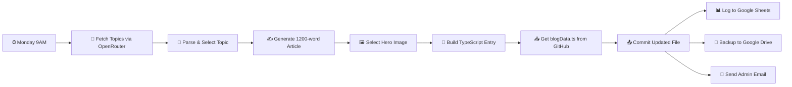

# CompliYUG n8n Automation — Setup Guide

## 📁 Files Created

| File | Purpose |
|------|---------|
| `n8n-workflows/compliyug-blog-automation.json` | Weekly blog generation + publish pipeline |
| `n8n-workflows/compliyug-subscriber-breach.json` | Subscriber intake + breach report automation |
| `src/app/api/posts/route.ts` | GET API for querying published articles |
| `src/app/api/webhook/subscribe/route.ts` | POST webhook for newsletter subscriptions |

---

## 🔄 Workflow 1: Weekly Blog Automation



### Pipeline Steps

1. **Trigger** — Runs every Monday at 9:00 AM IST
2. **Topic Generation** — OpenRouter (GPT-4o-mini) generates 3 trending DPDP/compliance topics
3. **Content Creation** — Full 1200-word article with SEO keywords, key takeaways, BreachBlitz CTA
4. **Image Selection** — Maps category/sector to curated Unsplash images
5. **Code Generation** — Builds TypeScript object matching `blogData.ts` schema exactly
6. **Git Commit** — Uses GitHub API to update `blogData.ts` directly on `main` branch
7. **Auto-Deploy** — Vercel detects the commit and rebuilds automatically
8. **Data Logging** — Article metadata saved to Google Sheets + JSON backup to Drive
9. **Notification** — Admin receives branded email with article link

---

## 🔄 Workflow 2: Subscriber & Breach Report

### Subscriber Flow
- Webhook receives email signups → validates → saves to Google Sheets → sends branded welcome email

### Breach Report Flow
- Webhook receives breach data → logs to Sheets → sends confirmation to user + alert to admin
- Includes 72-hour deadline warning and BreachBlitz CTA

---

## ⚙️ Required Environment Variables

Set these in your n8n instance under **Settings → Environment Variables**:

```
OPENROUTER_API_KEY=sk-or-v1-your-key-here
GITHUB_OWNER=Fenil2511
GITHUB_REPO=blog.compliyug
GITHUB_TOKEN=ghp_your-personal-access-token
GOOGLE_SHEET_ID=your-google-sheet-id
GOOGLE_DRIVE_FOLDER_ID=your-drive-folder-id
SMTP_FROM_EMAIL=noreply@compliyug.com
ADMIN_EMAIL=fenil@compliyug.com
N8N_SUBSCRIBE_WEBHOOK_URL=https://your-n8n.com/webhook/compliyug-subscribe
```

## 🔑 Required n8n Credentials

| Credential | Type | Used By |
|-----------|------|---------|
| `Google Sheets OAuth2` | Google Sheets OAuth2 | Sheets logging nodes |
| `Google Drive OAuth2` | Google Drive OAuth2 | Drive backup node |
| `CompliYUG SMTP` | SMTP | All email nodes |

> [!IMPORTANT]
> After importing, open each Google Sheets/Drive node and re-link your OAuth2 credentials. The `REPLACE_WITH_CREDENTIAL_ID` placeholders must be updated.

## 📥 Import Instructions

1. Open your n8n instance
2. Go to **Workflows → Import from File**
3. Import `compliyug-blog-automation.json` first
4. Import `compliyug-subscriber-breach.json` second
5. Update all credential references in each node
6. Set environment variables
7. Activate both workflows

## 🗂️ Google Sheets Setup

Create a Google Sheet with 3 tabs:

| Tab Name | Columns |
|----------|---------|
| **Blog Posts** | Date, Title, Slug, Category, Sector, URL, Status, ReadTime |
| **Subscribers** | Email, Name, Source, SubscribedAt, Status |
| **Breach Reports** | SubmittedAt, OrganizationName, ContactEmail, ContactName, BreachType, DataAffected, DiscoveryDate, IndividualsAffected, Description, Status |

## 🧪 Testing

1. **Blog workflow**: Run manually once with the "Test" button — verify the GitHub commit appears and Vercel rebuilds
2. **Subscriber**: `curl -X POST https://your-n8n/webhook/compliyug-subscribe -H "Content-Type: application/json" -d '{"email":"test@example.com","name":"Test"}'`
3. **Breach report**: Use the BreachBlitz tool on compliyug.com to submit a test report
